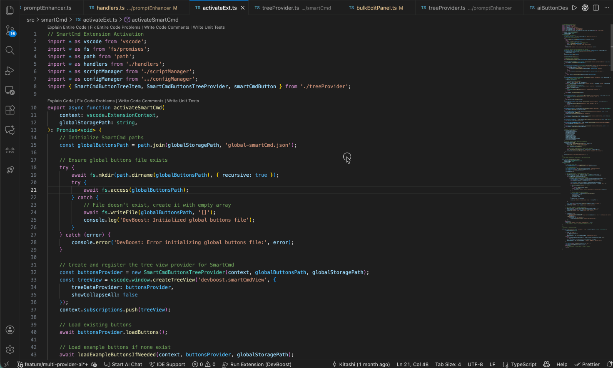
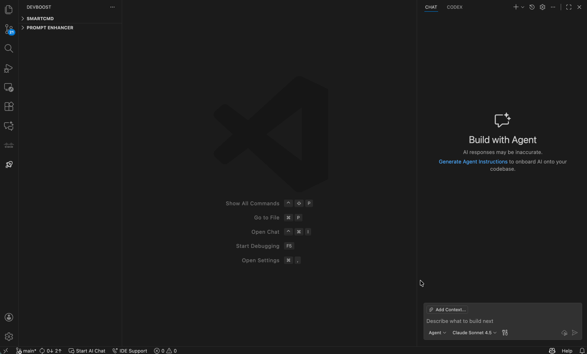

# DevBoost

[](https://open-vsx.org/extension/DevBoost/devboostextension)
[](https://www.typescriptlang.org/docs/handbook/release-notes/typescript-5-9.html)
[](https://code.visualstudio.com/)
[](LICENSE)


VS Code extension designed to supercharge developer productivity with AI-powered tools

## ✨ Current Features

### 🤖 SmartCmd - Custom Command Buttons



Create reusable command buttons for your frequent terminal operations:

- **Activity Tracking**: Logs terminal commands, tasks, debug session with execution context and exit codes.
- **AI-Generated Buttons**: Analyzes your activity log to suggest smart automation buttons
- **Manual Creation**: Create custom buttons with or without AI assistance  
- **Script Support**: Generate multi-step shell scripts for complex workflows
- **Scope Management**: Global buttons (all workspaces) or workspace-specific buttons
- **Button Groups**: Organize buttons into collapsible groups for better organization
- **Bulk Operations**: Edit, delete, or reorder multiple buttons at once with drag-and-drop
- **Dynamic Inputs**: Add runtime prompts for flexible command execution
- **Import/Export**: Share button configurations across workspaces or with team members via zip files

### 🔄 Prompt Enhancer


Improve your AI prompts before sending them:

- **Quick Enhancement**: Refine prompts for clarity, grammar, and structure
- **Tone Control**: Adjust formality and style (Professional, Casual, Technical, etc.)
- **Length Adjustment**: Make prompts shorter or more detailed
- **Selection Support**: Enhance selected text directly in the editor

## Quick Start

### Prerequisites

- **VS Code**: 1.105.0 or higher
- **AI Provider**: GitHub Copilot (recommended), or configure other providers (OpenAI, Claude, Gemini, Ollama)
- **Node.js**: 16.x or higher (for development)

### Installation

#### From VS Code Marketplace (Recommended)

1. Open VS Code
2. Go to Extensions (`Ctrl+Shift+X` / `Cmd+Shift+X`)
3. Search for **"DevBoost"**
4. Click **Install**

Or install directly:
- **VS Code Marketplace**: [DevBoost Extension](https://marketplace.visualstudio.com/items?itemName=DevBoost.devboostextension)
- **Open VSX Registry**: [DevBoost on Open VSX](https://open-vsx.org/extension/DevBoost/devboostextension)

#### From Source

```bash
git clone https://github.com/Kitashi14/DevBoost.git
cd DevBoost
npm install
npm run compile
# Press F5 to launch Extension Development Host
```

### Basic Usage

1. **Open DevBoost**: Click the 🚀 rocket icon in VS Code's activity bar
2. **Create Your First Button**:
   - Click ➕ in SmartCmd view
   - Choose **Global** or **Workspace** scope
   - Use AI assistance or create manually
   - Add command, name, and description
3. **Organize with Groups** (Optional):
   - Create groups in workspace/global section 
   - Name your group (e.g., "Git Commands", "Build Tasks")
   - Right-click buttons → "Add to Group"
4. **Execute**: Click any button to run its command
5. **Manage**: Right-click buttons/groups to edit, delete, or view scripts
6. **Share**: Export your commands to share with team or import from others

## Documentation

### SmartCmd Commands

**Available Commands** (Command Palette: `Ctrl+Shift+P` / `Cmd+Shift+P`):

- `DevBoost: Create AI Buttons` - Generate buttons from activity log
- `DevBoost: Create Custom Button` - Manual or AI-assisted button creation
- `DevBoost: Bulk Edit Buttons` - Multi-select operations and drag-drop reordering
- `DevBoost: Create Button Group` - Organize buttons into collapsible groups
- `DevBoost: Edit Groups` - Manage groups (rename, delete, reorder)
- `DevBoost: Export SmartCmds` - Export buttons, groups, and scripts to a zip file
- `DevBoost: Import SmartCmds` - Import commands from a zip file
- `DevBoost: Configure AI Model` - Switch between AI providers (Copilot, OpenAI, Claude, Gemini, Ollama)
- `DevBoost: Manage API Keys` - Store API keys securely for different providers

**Button Features**:

- **Input Fields**: Add `{variable}` placeholders for runtime values
- **Execution Directory**: Specify where commands run (e.g., `<workspace>`, `.`, or custom path)
- **Scripts**: Complex workflows stored as executable shell scripts
- **Cross-Platform**: Auto-detects OS for platform-specific commands
- **Groups**: Right-click buttons to add/remove from groups, organize commands logically

**Bulk Edit Panel** (`DevBoost: Bulk Edit Buttons`):
- Drag-and-drop to reorder buttons (within same scope)
- Multi-select with scope-level checkboxes
- Bulk actions: Set execution directory, delete multiple buttons
- Filter by type (scripts vs commands)

**Groups Management** (`DevBoost: Edit Groups`):
- Create collapsible groups to organize related buttons
- Drag-and-drop to reorder groups and buttons within groups
- Rename, delete groups with right-click context menu
- Remove individual buttons from groups
- Supports both workspace and global scopes

**Import/Export** (`DevBoost: Export/Import SmartCmds`):
- Export buttons, groups, and scripts to a shareable zip file
- Choose scope: global, workspace, or both
- Import with conflict resolution (skip, rename, or overwrite)
- Automatically handles script dependencies
- Share command sets across projects or with team members

### Prompt Enhancer Commands

- `DevBoost: Show Prompt Enhancer` - Open enhancement UI with analyze & generate features
- `DevBoost: Quick Enhance from Clipboard` - One-click enhancement from clipboard
- `DevBoost: Configure AI Model` - Switch between AI providers

### File Locations

**Workspace Files** (`.vscode/devBoost/`):
- `smartCmd.json` - Workspace button definitions and groups
- `scripts/` - Workspace-specific script files
- `activity.log` - Development activity tracking (auto-cleanup enabled)
- `ai_prompts_enhancer.log` - AI interaction logs for debugging, disabled in release version.

**Global Files** (Extension Storage):
- Global button definitions and groups
- Global script files
- AI provider configuration
- Encrypted API keys (when using external providers)

## 🛠️ Development

### Project Structure

```
src/
├── extension.ts              # Main extension entry point
├── activityLogging.ts        # Activity tracking system
├── configManager.ts          # Configuration management
├── shellHooks.ts             # Shell integration hooks
├── ai/                       # AI provider system
│   ├── aiProvider.ts         # Base AI provider interface
│   ├── providerManager.ts    # Provider selection & management
│   ├── types.ts              # AI provider type definitions
│   ├── index.ts              # AI module exports
│   └── providers/            # Multiple AI provider implementations
│       ├── vscodeCopilotProvider.ts  # GitHub Copilot integration
│       ├── anthropicProvider.ts      # Claude API support
│       ├── openaiProvider.ts         # OpenAI/ChatGPT support
│       ├── geminiProvider.ts         # Google Gemini support
│       ├── ollamaProvider.ts         # Local Ollama support
│       ├── cursorProvider.ts         # Cursor AI support
│       └── index.ts
├── commonView/               # Shared UI components
│   ├── customDialog.ts       # Custom dialog utilities
│   └── inputFormPanel.ts     # Input form webview
├── smartCmd/                 # SmartCmd feature module
│   ├── activateExt.ts        # SmartCmd initialization
│   ├── handlers.ts           # Button execution & management
│   ├── aiServices.ts         # AI integration for SmartCmd
│   ├── treeProvider.ts       # VS Code tree view provider
│   ├── scriptManager.ts      # Script generation & storage
│   ├── importExport.ts       # Import/export functionality
│   └── view/                 # SmartCmd UI panels
│       ├── bulkEditPanel.ts              # Bulk operations UI
│       ├── manualButtonFormPanel.ts      # Manual button creation
│       ├── editButtonFormPanel.ts        # Button editing UI
│       ├── groupEditPanel.ts             # Group management UI
│       └── aiButtonDescriptionPanel.ts   # AI button preview
└── promptEnhancer/           # Prompt Enhancer feature module
    ├── promptEnhancer.ts     # Core enhancement logic
    ├── aiServices.ts         # AI integration for prompts
    ├── handlers.ts           # Enhancement handlers & webview
    └── treeProvider.ts       # Tree view provider
```

### Build & Test

```bash
# Install dependencies
npm install

# Compile TypeScript
npm run compile

# Watch mode (auto-compile on save)
npm run watch

# Run extension in debug mode
# Press F5 in VS Code

# Package extension
npm run package
```

## Contributing

We welcome contributions! Please see our [Contributing Guide](CONTRIBUTING.md).


## Privacy & Security

- All data stored locally in `.vscode/devBoost/` and extension storage
- API keys encrypted and stored securely in VS Code secret storage
- No telemetry or analytics collected
- Choose your AI provider: GitHub Copilot, OpenAI, Claude, Gemini, or local Ollama

## License

This project is licensed under the GNU General Public License v3.0 - see [LICENSE](LICENSE) file for details.

## Acknowledgments

- **AI Providers** - GitHub Copilot, OpenAI, Anthropic Claude, Google Gemini, Ollama
- **VS Code Extension API** - Seamless IDE integration
- **Open Source Community** - For inspiration and support

## Support

- **Issues**: [GitHub Issues](https://github.com/Kitashi14/DevBoost/issues)
- **Discussions**: [GitHub Discussions](https://github.com/Kitashi14/DevBoost/discussions)
- **Repository**: [github.com/Kitashi14/DevBoost](https://github.com/Kitashi14/DevBoost)

---


